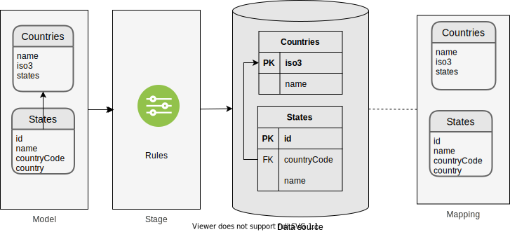

# Lab 01

In this laboratory we will see:

- How to use the Lambdaorm-cli commands
- how to create a project that uses lambda ORM
- How to define a schema
- how to run a bulckInsert from a file
- how to export data from a schema
- how to import data into a schema from a previously generated export file

## Schema diagram

The schema defines how the entities of the model are mapped with the database tables.



## Pre requirements

### Create database for test

Create file "docker-compose.yaml"

```yaml
version: '3'
services:
  test:
    container_name: lambdaorm-test
    image: mysql:5.7
    restart: always
    environment:
      - MYSQL_DATABASE=test
      - MYSQL_USER=test
      - MYSQL_PASSWORD=test
      - MYSQL_ROOT_PASSWORD=root
    ports:
      - 3306:3306
```

Create MySql database for test:

```sh
docker-compose up -d
```

Create user:

```sh
docker exec lambdaorm-test  mysql --host 127.0.0.1 --port 3306 -uroot -proot -e "ALTER DATABASE test CHARACTER SET utf8 COLLATE utf8_general_ci;"
docker exec lambdaorm-test  mysql --host 127.0.0.1 --port 3306 -uroot -proot -e "GRANT ALL ON *.* TO 'test'@'%' with grant option; FLUSH PRIVILEGES;"
```

### Install lambda ORM CLI

Install the package globally to use the CLI commands to help you create and maintain projects

```sh
npm install lambdaorm-cli -g
```

## Test

### Create project

will create the project folder with the basic structure.

```sh
lambdaorm init -w lab_01
```

position inside the project folder.

```sh
cd lab_01
```

### Complete Schema

In the creation of the project the schema was created but without any entity.
Add the Country entity as seen in the following example

```yaml
entities:
  - name: Countries
    primaryKey: ["iso3"]
    uniqueKey: ["name"]
    properties:
      - name: name
        nullable: false
      - name: iso3
        nullable: false
        length: 3
    relations:
      - name: states
        type: manyToOne
        composite: true
        from: iso3
        entity: States
        to: countryCode
  - name: States
    primaryKey: ["id"]
    uniqueKey: ["countryCode", "name"]
    properties:
      - name: id
        type: integer
        nullable: false
      - name: name
        nullable: false
      - name: countryCode
        nullable: false
        length: 3
    relations:
      - name: country
        from: countryCode
        entity: Countries
        to: iso3
dataSources:
  - name: mydb
    dialect: mysql
    schema: countries
    connection:
      host: localhost
      port: 3306
      user: test
      password: test
      database: test
      multipleStatements: true
      waitForConnections: true
      connectionLimit: 10
      queueLimit: 0
```

### Update

```sh
lambdaorm update
```

the file model will be created inside src/models/countries/model.ts  with the following content

```ts
/* eslint-disable no-use-before-define */
// THIS FILE IS NOT EDITABLE, IS MANAGED BY LAMBDA ORM
import { Queryable } from 'lambdaorm'
export class Country {
	constructor () {
		this.states = []
	}

	name?: string
	iso3?: string
	states: State[]
}
export interface QryCountry {
	name: string
	iso3: string
	states: ManyToOne<State> & State[]
}
export class State {
	id?: number
	name?: string
	countryCode?: string
	country?: Country
}
export interface QryState {
	id: number
	name: string
	countryCode: string
	country: Country & OneToMany<Country> & Country
}
export let Countries: Queryable<QryCountry>
export let States: Queryable<QryState>
```

### Sync

```sh
lambdaorm sync
```

It will generate the table in database and a status file in the "data" folder, with the following content:

```json
{
	"mappings": [
		{
			"name": "default",
			"entities": [
				{
					"name": "Countries",
					"mapping": "Countries",
					"primaryKey": ["iso3"],
					"uniqueKey": ["name"],
					"properties": [
						{	"name": "name",	"nullable": false,"type": "string","length": 80,"mapping": "name"	},
						{	"name": "iso3",	"nullable": false,"length": 3,"type": "string","mapping": "iso3" }
					],
					"relations": [
						{ "name": "states", "type": "manyToOne", "composite": true, "from": "iso3", "entity": "States",	"to": "countryCode"	}
					]					
				},
				{
					"name": "States",
					"mapping": "States",
					"primaryKey": ["id"],
					"uniqueKey": ["countryCode","name"],
					"properties": [
						{ "name": "id", "type": "integer", "nullable": false,	"mapping": "id"	},
						{ "name": "name",	"nullable": false,"type": "string","length": 80,"mapping": "name"	},
						{ "name": "countryCode", "nullable": false, "length": 3, "type": "string", "mapping": "countryCode" }
					],
					"relations": [
						{ "name": "country", "from": "countryCode", "entity": "Countries", "to": "iso3", "type": "oneToMany" }
					]					
				}
			]
		}
	],
	"mappingData": {},
	"pendingData": []
}
```

### Popuplate Data

we will import data in the countries and states entities from the data.json file that is in the root of the project

then we execute

```sh
lambdaorm run -e "Countries.bulkInsert().include(p => p.states)" -d ./data.json
```

### Export Data

```sh
lambdaorm export 
```

will generate a file called "mydb-export.json"

### Import Data

Before importing we are going to delete all the records:

```sh
lambdaorm run -e "States.deleteAll()"
lambdaorm run -e "Countries.deleteAll()"
```

We verify that there are no records left:

```sh
lambdaorm run -e "Countries.page(1,10).include(p => p.states)"
```

we import the file that we generate when exporting

```sh
lambdaorm import -d ./default-export.json
```

We verify that the data was imported.

```sh
lambdaorm run -e "Countries.page(1,10).include(p => p.states)"
```

### Drop

remove all tables from the schema and delete the state file, mydb-state.json

```sh
lambdaorm drop
```

## End

### Remove database for test

Remove MySql database:

```sh
docker-compose down
```
